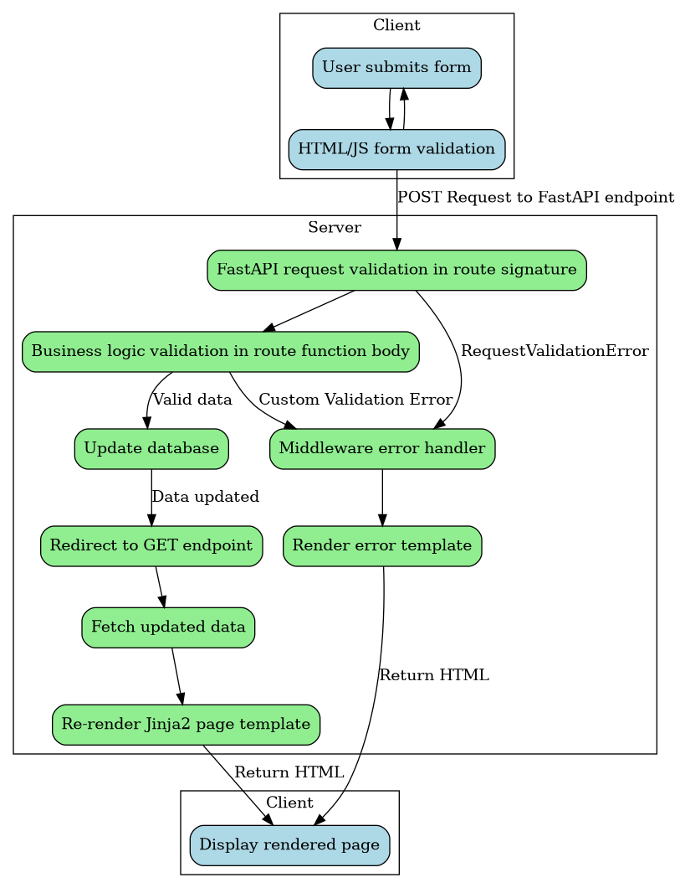

## Data flow

This application uses a **hybrid Post-Redirect-Get (PRG) + HTMX** architecture. Every mutating endpoint supports both paths simultaneously:

- **Non-HTMX path (PRG):** A standard browser form submission sends a POST request. On success the server issues a `303 See Other` redirect to a GET endpoint, which re-renders the full page with updated data. On error a full-page error template is returned.
- **HTMX path:** When the browser sends the `HX-Request: true` header (added automatically by [htmx.org](https://htmx.org)), the same POST endpoint detects the header via `utils/htmx.py:is_htmx_request()` and instead returns a `200` HTML partial that HTMX swaps into the relevant section of the page. On error a toast partial is returned and swapped into `#toast-container` via out-of-band (OOB) swap.

The HTMX rollout keeps the existing POST route contract intact — dedicated `PUT`/`PATCH`/`DELETE` routes may be introduced in a future iteration.

### PRG path

``` {python}
#| echo: false
#| include: false
from graphviz import Digraph

dot = Digraph()
dot.attr(rankdir='TB')
dot.attr('node', shape='box', style='rounded')

# Create client subgraph at top
with dot.subgraph(name='cluster_client') as client:
    client.attr(label='Client')
    client.attr(rank='topmost')
    client.node('A', 'User submits form', fillcolor='lightblue', style='rounded,filled')
    client.node('B', 'HTML/JS form validation', fillcolor='lightblue', style='rounded,filled')

# Create server subgraph below
with dot.subgraph(name='cluster_server') as server:
    server.attr(label='Server')
    server.node('C', 'FastAPI request validation in route signature', fillcolor='lightgreen', style='rounded,filled')
    server.node('D', 'Business logic validation in route function body', fillcolor='lightgreen', style='rounded,filled')
    server.node('E', 'Update database', fillcolor='lightgreen', style='rounded,filled')
    server.node('F', 'Middleware error handler', fillcolor='lightgreen', style='rounded,filled')
    server.node('G', 'Render error template', fillcolor='lightgreen', style='rounded,filled')
    server.node('H', 'Redirect to GET endpoint', fillcolor='lightgreen', style='rounded,filled')
    server.node('I', 'Fetch updated data', fillcolor='lightgreen', style='rounded,filled')
    server.node('K', 'Re-render Jinja2 page template', fillcolor='lightgreen', style='rounded,filled')

with dot.subgraph(name='cluster_client_post') as client_post:
    client_post.attr(label='Client')
    client_post.attr(rank='bottommost')
    client_post.node('J', 'Display rendered page', fillcolor='lightblue', style='rounded,filled')

# Add visible edges
dot.edge('A', 'B')
dot.edge('B', 'A')
dot.edge('B', 'C', label='POST Request to FastAPI endpoint')
dot.edge('C', 'D')
dot.edge('C', 'F', label='RequestValidationError')
dot.edge('D', 'E', label='Valid data')
dot.edge('D', 'F', label='Custom Validation Error')
dot.edge('E', 'H', label='Data updated')
dot.edge('H', 'I')
dot.edge('I', 'K')
dot.edge('K', 'J', label='Return HTML')
dot.edge('F', 'G')
dot.edge('G', 'J', label='Return HTML')

dot.render('static/data_flow_prg', format='png', cleanup=True)
```



### HTMX path

``` {python}
#| echo: false
#| include: false
from graphviz import Digraph

dot = Digraph()
dot.attr(rankdir='TB')
dot.attr('node', shape='box', style='rounded')

with dot.subgraph(name='cluster_client_htmx') as client:
    client.attr(label='Client (HTMX)')
    client.node('A2', 'User submits form', fillcolor='lightblue', style='rounded,filled')
    client.node('B2', 'HTML/JS form validation', fillcolor='lightblue', style='rounded,filled')

with dot.subgraph(name='cluster_server_htmx') as server:
    server.attr(label='Server')
    server.node('C2', 'FastAPI request validation\n(HX-Request: true detected)', fillcolor='lightgreen', style='rounded,filled')
    server.node('D2', 'Business logic validation', fillcolor='lightgreen', style='rounded,filled')
    server.node('E2', 'Update database', fillcolor='lightgreen', style='rounded,filled')
    server.node('F2', 'Exception handler\n(is_htmx_request branch)', fillcolor='lightgreen', style='rounded,filled')
    server.node('G2', 'Render toast partial\n(#toast-container OOB swap)', fillcolor='lightgreen', style='rounded,filled')
    server.node('H2', 'Render HTML partial\n(target element swap)', fillcolor='lightgreen', style='rounded,filled')

with dot.subgraph(name='cluster_client_post_htmx') as client_post:
    client_post.attr(label='Client (HTMX)')
    client_post.node('J2', 'HTMX swaps partial\ninto DOM', fillcolor='lightblue', style='rounded,filled')
    client_post.node('K2', 'Toast displayed\n(no page reload)', fillcolor='lightyellow', style='rounded,filled')

dot.edge('A2', 'B2')
dot.edge('B2', 'A2')
dot.edge('B2', 'C2', label='POST + HX-Request: true')
dot.edge('C2', 'D2')
dot.edge('C2', 'F2', label='RequestValidationError')
dot.edge('D2', 'E2', label='Valid data')
dot.edge('D2', 'F2', label='Custom Validation Error')
dot.edge('E2', 'H2', label='Data updated')
dot.edge('H2', 'J2', label='200 HTML partial')
dot.edge('F2', 'G2')
dot.edge('G2', 'K2', label='422/400/401 toast partial')

dot.render('static/data_flow_htmx', format='png', cleanup=True)
```


The PRG path is preserved for all non-HTMX clients (e.g. browsers with JavaScript disabled, automated tests that do not send `HX-Request`). The HTMX path adds in-place partial updates and toast-based error handling on top of the same POST endpoints, with no change to the route URLs or form field contracts.

### Form validation and error handling

| Scenario | Non-HTMX (PRG) | HTMX |
|---|---|---|
| `RequestValidationError` (missing/invalid field) | Full-page error template, `422` | Toast partial via `#toast-container` OOB swap, `422` |
| Business logic error (`HTTPException`) | Full-page error template | Toast partial, `400`/`401`/`403`/`404` |
| Login failure (`CredentialsError`) | Full-page error template, `401` | Toast partial, `401` |
| Success | `303` redirect → GET → full page | `200` HTML partial swapped into target element |

Toast partials are rendered from `templates/base/partials/toast.html` and injected into the persistent `#toast-container` div in `base.html` using `hx-swap-oob="true"`. The toast is displayed using Bootstrap's toast component and can be dismissed by the user.

### HTMX request detection

All HTMX-aware endpoints use the `is_htmx_request()` helper from `utils/htmx.py`:

```python
def is_htmx_request(request: Request) -> bool:
    return request.headers.get("HX-Request") == "true"
```

HTMX automatically adds the `HX-Request: true` header to every request it initiates. Non-HTMX form submissions (standard browser POSTs) do not include this header, so they follow the PRG path unchanged.