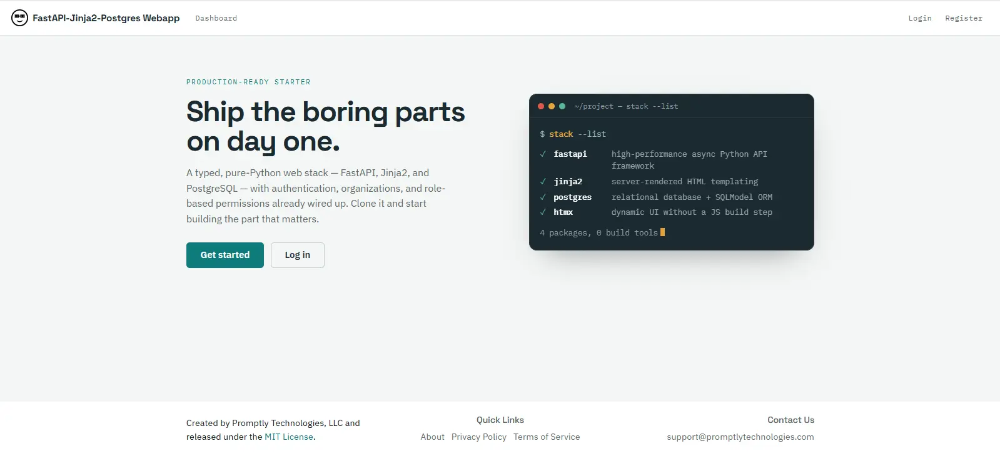

# FastAPI, Jinja2, PostgreSQL Webapp Template


<figure class="figure">
<p></p>
<figcaption>Screenshot of the FastAPI webapp template homepage</figcaption>
</figure>


# Quickstart

This quickstart guide provides a high-level overview. See the full documentation for comprehensive information on [features](https://promptlytechnologies.com/fastapi-jinja2-postgres-webapp/), [installation](https://promptlytechnologies.com/fastapi-jinja2-postgres-webapp/user-guide/installation.html), [architecture](https://promptlytechnologies.com/fastapi-jinja2-postgres-webapp/user-guide/architecture.html), [conventions, code style, and customization](https://promptlytechnologies.com/fastapi-jinja2-postgres-webapp/user-guide/customization.html), [deployment to cloud platforms](https://promptlytechnologies.com/fastapi-jinja2-postgres-webapp/user-guide/deployment.html), and [contributing](https://promptlytechnologies.com/fastapi-jinja2-postgres-webapp/user-guide/contributing.html).


# Features

This template combines three of the most lightweight and performant open-source web development frameworks into a customizable webapp template with:

- Pure Python backend
- Minimal-Javascript frontend
- Powerful, easy-to-manage database

The template also includes full-featured secure auth with:

- Token-based authentication
- Password recovery flow
- Role-based access control system


# Design Philosophy

The design philosophy of the template is to prefer low-level, best-in-class open-source frameworks that offer flexibility, scalability, and performance without vendor-lock-in. You'll find the template amazingly easy not only to understand and customize, but also to deploy to any major cloud hosting platform.


# Tech Stack

**Core frameworks:**

- [FastAPI](https://fastapi.tiangolo.com/): scalable, high-performance, type-annotated Python web backend framework
- [PostgreSQL](https://www.postgresql.org/): the world's most advanced open-source database engine
- [Jinja2](https://jinja.palletsprojects.com/en/3.1.x/): frontend HTML templating engine
- [SQLModel](https://sqlmodel.tiangolo.com/): easy-to-use Python ORM

**Additional technologies:**

- [uv](https://docs.astral.sh/uv/): Python dependency manager
- [Pytest](https://docs.pytest.org/en/7.4.x/): testing framework
- [Docker](https://www.docker.com/): development containerization
- [Github Actions](https://docs.github.com/en/actions): CI/CD pipeline
- [Great Docs](https://posit-dev.github.io/great-docs/): documentation website generator
- [ty](https://docs.astral.sh/ty/): static type checker for Python
- [htmx](https://htmx.org/): dynamic HTML interactions with no JS build step (the frontend is styled with a custom, dependency-free stylesheet)
- [Resend](https://resend.com/): zero- or low-cost email service used for password recovery


# Installation

For comprehensive installation instructions, see the [installation page](https://promptlytechnologies.com/fastapi-jinja2-postgres-webapp/user-guide/installation.html).


## uv

MacOS and Linux:

``` bash
wget -qO- https://astral.sh/uv/install.sh | sh
```

Windows:

``` bash
powershell -ExecutionPolicy ByPass -c "irm https://astral.sh/uv/install.ps1 | iex"
```

See the [uv installation docs](https://docs.astral.sh/uv/getting-started/installation/) for more information.


## Python

Install Python 3.12 or higher from either the official [downloads page](https://www.python.org/downloads/) or using uv:

``` bash
uv python install
```


## Docker and Docker Compose

Install Docker Desktop and Coker Compose for your operating system by following the [instructions in the documentation](https://docs.docker.com/compose/install/).


## PostgreSQL headers

For Ubuntu/Debian:

``` bash
sudo apt update && sudo apt install -y python3-dev libpq-dev libwebp-dev
```

For macOS:

``` bash
brew install postgresql
```

For Windows:

- No installation required


## Python dependencies

From the root directory, run:

``` bash
uv venv
uv sync
```

This will create an in-project virtual environment and install all dependencies.


## Set environment variables

Copy `.env.example` to `.env` with `cp .env.example .env`.

Generate a 256 bit secret key with `openssl rand -base64 32` and paste it into the .env file.

Set your desired database name, username, and password in the .env file.

To use password recovery and other email features, register a [Resend](https://resend.com/) account, verify a domain, get an API key, and paste the API key and the email address you want to send emails from into the .env file. Note that you will need to [verify a domain through the Resend dashboard](https://resend.com/docs/dashboard/domains/introduction) to send emails from that domain.


## Start development database

To start the development database, run the following command in your terminal from the root directory:

``` bash
docker compose up -d
```


## Run the development server

Make sure the development database is running and tables and default permissions/roles are created first.

``` bash
uv run python -m uvicorn main:app --host 0.0.0.0 --port 8000 --reload
```

Navigate to http://localhost:8000/


## Type check with ty

``` bash
uv run ty check .
```


# Developing with LLMs

The `.cursor/rules` folder contains a set of AI rules for working on this codebase in the Cursor IDE. The documentation site also publishes [llms.txt](https://promptlytechnologies.com/fastapi-jinja2-postgres-webapp/llms.txt) and [llms-full.txt](https://promptlytechnologies.com/fastapi-jinja2-postgres-webapp/llms-full.txt) for easy downloading and embedding for RAG.


# Contributing

Your contributions are welcome! See the [issues page](https://github.com/promptly-technologies-llc/fastapi-jinja2-postgres-webapp/issues) for ideas. Fork the repository, create a new branch, make your changes, and submit a pull request.


# License

This project is created and maintained by [Promptly Technologies, LLC](https://promptlytechnologies.com/) and licensed under the MIT License. See the LICENSE file for more details.


### AI / Agents

[Skills](skills.md)  
[llms.txt](llms.txt)  
[llms-full.txt](llms-full.txt)  


### Developers


**Christopher Carroll Smith**

<span style="margin-top: -0.15em; display: block;"> </span>

Author

<span style="margin-top: -0.15em; display: block;">[](mailto:chriscarrollsmith@gmail.com "Email")</span>


**Promptly Technologies, LLC**

<span style="margin-top: -0.15em; display: block;"> </span>

Copyright holder


### Community

[Full license](./license.html)  


### Meta

**Requires:** Python `<4.0,>=3.13`
