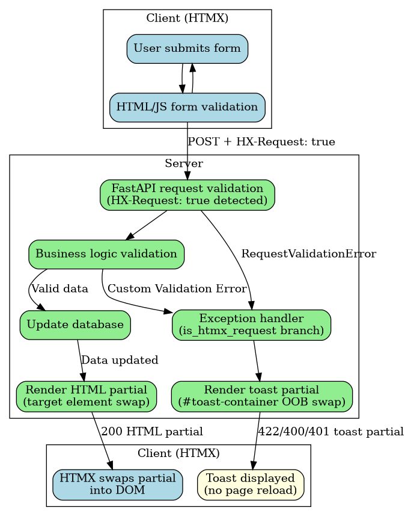

# Architecture


# Data flow

This application uses a **hybrid Post-Redirect-Get (PRG) + HTMX** architecture. Every mutating endpoint supports both paths simultaneously:

- **Non-HTMX path (PRG):** A standard browser form submission sends a POST request. On success the server issues a `303 See Other` redirect to a GET endpoint, which re-renders the full page with updated data. On error a full-page error template is returned.
- **HTMX path:** When the browser sends the `HX-Request: true` header (added automatically by [htmx.org](https://htmx.org)), the same POST endpoint detects the header via `utils/core/htmx.py:is_htmx_request()` and instead returns a `200` HTML partial that HTMX swaps into the relevant section of the page. On error a toast partial is returned and swapped into `#toast-container` via out-of-band (OOB) swap.

The HTMX rollout keeps the existing POST route contract intact -- dedicated `PUT`/`PATCH`/`DELETE` routes may be introduced in a future iteration.


## PRG path


<figure class="figure">
<p></p>
<figcaption>PRG data flow diagram</figcaption>
</figure>


## HTMX path


<figure class="figure">
<p></p>
<figcaption>HTMX data flow diagram</figcaption>
</figure>


The PRG path is preserved for all non-HTMX clients (e.g. browsers with JavaScript disabled, automated tests that do not send `HX-Request`). The HTMX path adds in-place partial updates and toast-based error handling on top of the same POST endpoints, with no change to the route URLs or form field contracts.


## Form validation and error handling

| Scenario | Non-HTMX (PRG) | HTMX |
|----|----|----|
| `RequestValidationError` (missing/invalid field) | Full-page error template, `422` | Toast partial via `#toast-container` OOB swap, `422` |
| Business logic error (`HTTPException`) | Full-page error template | Toast partial, `400`/`401`/`403`/`404` |
| Login failure (`CredentialsError`) | Full-page error template, `401` | Toast partial, `401` |
| Success | `303` redirect → GET → full page | `200` HTML partial swapped into target element |

Toast partials are rendered from `templates/base/partials/toast.html` and injected into the persistent `#toast-container` div in `base.html` using `hx-swap-oob="true"`. The toast is displayed using Bootstrap's toast component and can be dismissed by the user.


## HTMX request detection

All HTMX-aware endpoints use the `is_htmx_request()` helper from `utils/core/htmx.py`:

``` python
def is_htmx_request(request: Request) -> bool:
    return request.headers.get("HX-Request") == "true"
```

HTMX automatically adds the `HX-Request: true` header to every request it initiates. Non-HTMX form submissions (standard browser POSTs) do not include this header, so they follow the PRG path unchanged.
