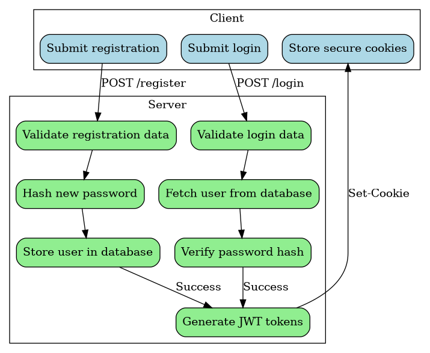
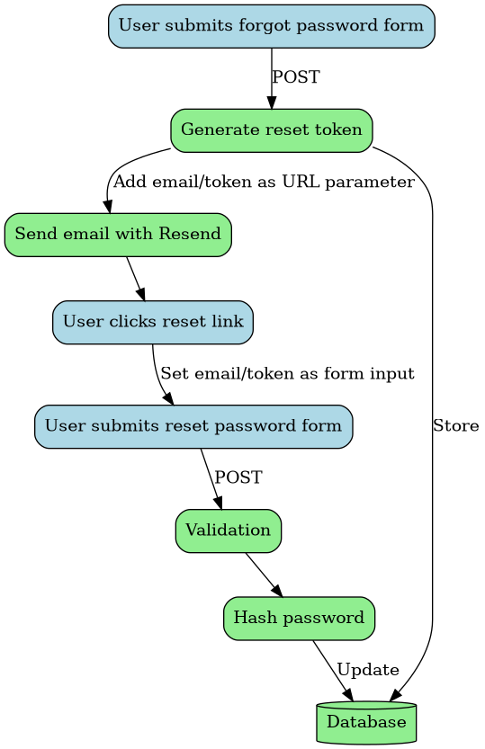

# Authentication

# Security features

This template implements a comprehensive authentication system with security best practices:

1.  **Token Security**:
    - JWT-based with separate access/refresh tokens
    - Strict expiry times (30 min access, 30 day refresh)
    - Token type validation
    - HTTP-only cookies
    - Secure flag enabled
    - SameSite=strict restriction
2.  **Password Security**:
    - Strong password requirements enforced
    - Bcrypt hashing with random salt
    - Password reset tokens are single-use
    - Reset tokens have expiration
3.  **Cookie Security**:
    - HTTP-only prevents JavaScript access
    - Secure flag ensures HTTPS only
    - Strict SameSite prevents CSRF
4.  **Error Handling**:
    - Validation errors properly handled
    - Security-related errors don't leak information
    - Comprehensive error logging

The diagrams below show the main authentication flows.

# Registration and login flow

<figure class="figure">

<figcaption>Registration and login flow</figcaption>
</figure>

# Password reset flow

<figure class="figure">

<figcaption>Password reset flow</figcaption>
</figure>
